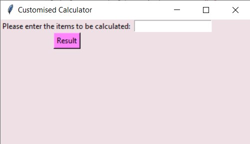
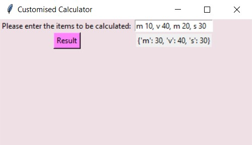

# category-calculator
It is a calculator that can calculate items provided in a stingle input and adds up the duplicate values for the result. The user interface is developed using Tkinter module of python.

Input format: Item value, (eg: vegetable 20, millk 10, orange 30, chocolate 50, milk 20)

